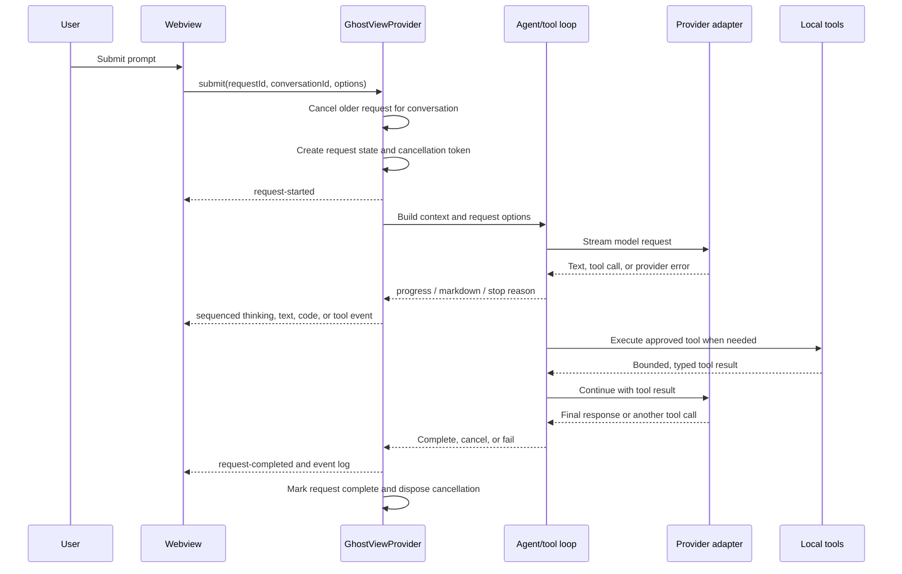
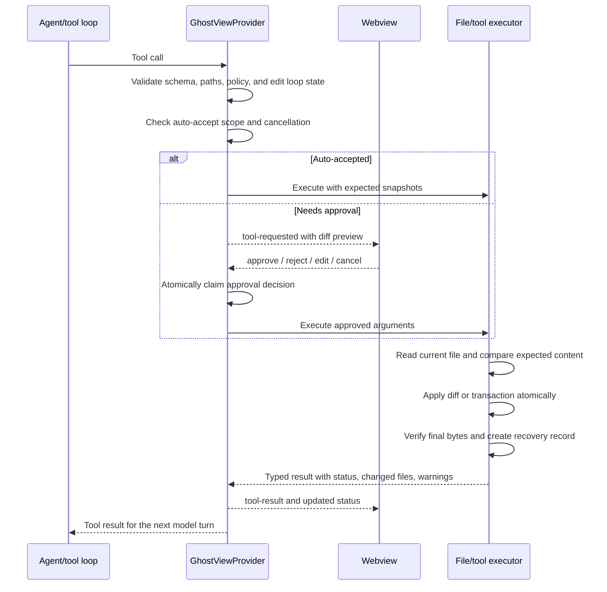
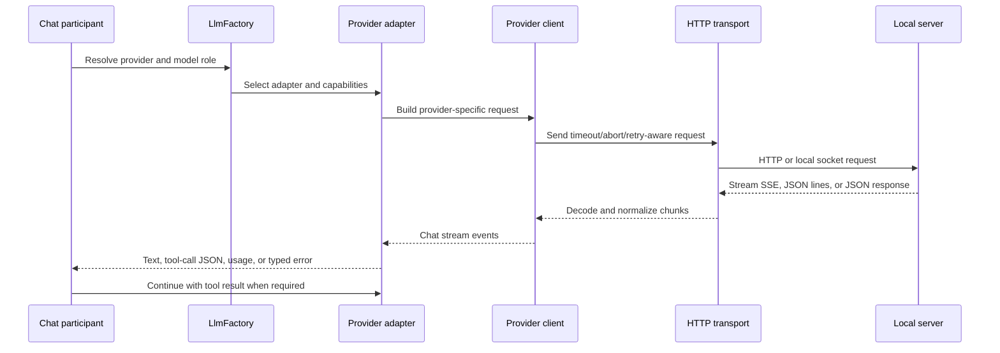

# Ghost interface architecture

Ghost is a VS Code extension host with a browser-like webview. The host is the authority for anything that can access a provider, workspace, secret, file, terminal, or persistent store. The webview is responsible for presentation and user input; it never performs workspace or provider work directly.

## Runtime boundaries

```text
┌──────────────────────────── VS Code extension host ────────────────────────────┐
│ GhostViewProvider                                                               │
│  ├─ GhostStateStore / GhostRequestOrchestrator                                  │
│  ├─ context collection, settings, persistence, redaction                       │
│  ├─ approvals, staged edits, recovery records, cancellation                     │
│  ├─ chatParticipant tool loop                                                   │
│  └─ provider adapters ── transport ── Ollama / MLX / OpenAI-compatible server   │
│       │                                                                         │
│       └─ local tools ── workspace files, search, diagnostics, terminal, git     │
└───────────────────────────────┬────────────────────────────────────────────────┘
                                │ versioned Ghost protocol messages
┌────────────────────────────────▼────────────────────────────────────────────────┐
│ Webview                                                                         │
│  ghostWebviewShell → composer, modals, live regions                            │
│  ghostWebviewProtocolClient → validation and message transport                  │
│  conversation/settings/history stores → short-lived UI state                    │
│  rendering/tool timeline → DOM updates and progress animation                   │
└─────────────────────────────────────────────────────────────────────────────────┘
```

The protocol is defined in `src/ui/ghostProtocol.ts` and shared with the webview through `src/webview/ghostWebviewTypes.ts`. Messages have a source, protocol version, request ID, and conversation ID. Stream events have a monotonically increasing sequence number. The webview drops an event for an older request or sequence, which prevents delayed provider output from overwriting newer UI state.

## State ownership

| State | Owner | Persistence | Rule |
| --- | --- | --- | --- |
| Request status, cancellation, attempt count, timing, event log | `GhostStateStore` in the extension host | No; transient | One active request per conversation. Completion removes the live request and records its ID briefly for duplicate protection. |
| Pending approvals and staged edits | `GhostStateStore` and `GhostViewProvider` | No; transient | Only the host can approve or execute a tool. Cancellation rejects pending approvals. |
| Recovery records and failed-tool retries | Extension host | No; transient | Used to restore or retry a known edit without trusting stale model arguments. |
| Provider health, model list, capability metadata | `GhostViewProvider` provider state | Cache with TTL | Cache keys include provider settings and whether an API key is available. |
| Conversations, active conversation ID | Webview model mirrored to host state | Workspace storage, opt-in | Host compacts, redacts, validates, and writes the canonical safe snapshot. |
| Preferences, presets, prompt history | Webview model mirrored to host state | Global storage, opt-in | Kept separate from workspace conversations. |
| Composer draft, modal visibility, focus, animation | Webview | No | UI-only state; it may be reconstructed after reload. |
| Provider credentials | VS Code secrets | Secret storage | Never placed in protocol messages, conversation state, exports, or diagnostics. |

`GhostStateStore` emits typed state events. `GhostViewProvider` uses those events to refresh controls and status messages, while the webview stores and renders the resulting protocol state.

## Request sequence



### Request states

`src/ui/requestState.ts` defines the shared transition policy. The normal path is:

`idle → preparing → connecting → thinking → streaming → completed`

Tool work can move the request to `waiting-for-approval` and back to `thinking`. Terminal states are `completed`, `cancelled`, and `failed`. Timeout, provider failure, invalid model output, context limits, budget limits, failed tools, and rejected approvals are recorded as separate stop reasons so the UI can offer the right recovery action.

The host retries only recoverable provider connectivity failures, with bounded backoff. It does not blindly retry user cancellation, invalid arguments, approval rejection, or a stale edit.

## Approval and edit sequence



Read and directory tools follow the workspace path policy and bounded output rules. Writes, structured edits, transactions, and terminal commands are approval-controlled. Edit hunks must carry old text, a hash, or context unless the complete expected file is supplied. Before writing, the executor re-reads the file and rejects an external change. Atomic writes use a temporary file and backup; a failed transaction restores earlier files. A post-write read verifies the result.

The edit loop guard tracks normalized file paths, signatures, ranges, and hunk direction. Repeated, inverse, or overlapping edits stop with a recovery message instead of repeatedly changing the same file.

## Provider sequence



`src/services/providerRequestBuilders.ts` keeps unsupported parameters out of provider payloads. `providerAdapter.ts` exposes a common stream and capability contract, while Ollama, MLX/VLM, and OpenAI-compatible clients handle their wire formats. Transport code owns timeouts, abort signals, proxy/TLS settings, authentication headers, keep-alive agents, and diagnostic errors. Incomplete stream records are buffered until complete; invalid UTF-8 and malformed provider output become bounded Ghost errors.

## Persistence schema and privacy

Persistence is opt-in. The host reads two versioned records:

```text
global:    ghost.global.v2
  schemaVersion
  promptHistory[]
  presets[]
  showReasoning
  preferences{}

workspace: ghost.workspace.v2
  schemaVersion
  conversations[]
  activeConversationId
```

The webview sends a `persist-state` message. The host then:

1. validates and migrates the state to `GHOST_PERSISTENCE_SCHEMA_VERSION`;
2. redacts sensitive strings recursively;
3. bounds strings, conversations, messages, parts, event logs, and presets;
4. splits global and workspace fields;
5. skips unchanged writes using JSON snapshots;
6. updates both stores and sends the safe state back to the webview.

Import uses the same parser and persistence path. Export, diagnostics, tool results, protocol events, and visible errors pass through redaction and output limits. Disabling persistence clears both stores and leaves only in-memory state.

## Failure recovery

| Failure | Host behavior | User recovery |
| --- | --- | --- |
| Provider timeout/network error | Retry bounded times, then emit a redacted failure and mark offline when appropriate | Check provider, retry request |
| User cancellation or view disposal | Cancel token, reject approvals, stop timers, discard transient request state | Submit a new request |
| Empty or malformed model output | Classify output, issue bounded corrective prompts, then stop with a precise invalid-response message | Retry with a smaller or clearer request |
| Repeated file range | Reuse the earlier read result for an exact signature | Continue from the existing context |
| Missing file or invalid path | Return a typed tool failure without creating a file | Correct the path or inspect workspace roots |
| Stale or conflicting edit | Re-read current content, allow a bounded rebase retry, then stop | Review current file and approve a fresh edit |
| Failed write or transaction | Restore backups, clean temporary files, verify rollback | Retry after resolving filesystem issue |
| Protocol version/sequence mismatch | Negotiate supported version or ignore stale/invalid event | Reload the webview if negotiation cannot complete |
| Persistence failure | Log redacted error, retain in-memory state, report persistence status | Retry after storage or permission issue is fixed |

## Testing map

Fast plain-Node tests run with `npm run test:fast`; extension-host tests run with `npm run test:host`. `npm test` compiles and runs both.

- `protocol.test.ts`, `requestState.test.ts`, and `persistenceModel.test.ts`: message validation, lifecycle transitions, migrations, and bounded state.
- `ollamaClient.test.ts`, `providerResilience.test.ts`, `providerAdapterContract.test.ts`, and `providerRequestFixtures.test.ts`: provider streams, errors, capabilities, and payload contracts.
- `toolCallParser.test.ts`, `editWorkflow.test.ts`, and `propertyFuzz.test.ts`: model tool output, edit safety, and malformed input.
- `webviewAccessibility.test.ts` and `accessibilityAudit.test.ts`: focus, approval shortcuts, live regions, contrast, motion, and keyboard contracts.
- `regressionFixtures.test.ts`: named fixtures for real failures in `src/test/fixtures/regressions/`.
- `editSafety.test.ts`, `fakeProviderIntegration.test.ts`, and `fileTools.test.ts`: VS Code filesystem, approval, rollback, provider, and workspace integration behavior.
- `webviewIntegration.test.ts`: accessible webview markup, multiline requests, attachments, lifecycle events, and duplicate request protection.

CI runs the fast suite on every change, the extension-host suite on Linux, macOS, and Windows, dependency audit checks, package creation, and VSIX install smoke validation.
